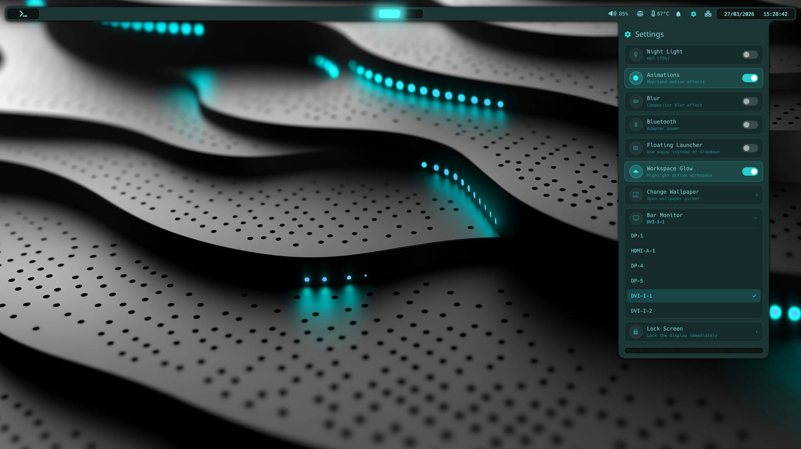

# Quickshell Configuration



A highly customized Wayland status bar and system interface built with [Quickshell](https://quickshell.outfoxxed.me/) for Hyprland.

## Disclaimer

This was created as a fun learning project — inspiration taken from end_4, Noctalia, etc. Love those drawer animations!
This is in no way to be taken as a "this is how to do a thing..." it is purely "this is how I have done a thing..."

I found there was a lack of tutorials and trying to learn by reverse engineering some other dotfiles was a little overwhelming.

Much of the code was initially created using Claude AI. I then ventured into the Quickshell Discord and sought some help and advice.
Since then I have learnt quite a bit (still more to learn!) 

I'm putting this out there in the hope it may help or inspire people.

Feel free to use however you want, Just give me a shout out (SiSPX_ on reddit) if you find it helpful.

Once again, a massive shout out to the people on Discord for helping me out.

---

**Last Updated**: March 29, 2026

---

## Overview

A feature-rich top panel for Hyprland with smooth animations, reactive system state, and dropdown panels for everything. The bar is divided into three sections:

- **Left** — App launcher button, wallpaper picker
- **Center** — Hyprland workspace indicators with glow overlay
- **Right** — Package updates, VPN, Bluetooth, volume with audio visualizer, power profile, temperature, system tray, notifications, lockscreen, clock

---

## File Structure

```
quickshell/
├── shell.qml                        # Entry point & top bar layout
├── Colors.qml                       # Theme color tokens (auto-updated by matugen)
├── Config.qml                       # Global settings (font, barMonitor, animations, blur)
├── NumbersToText.qml                # Global utility: converts integers to English words
├── cava.conf                        # CAVA audio visualizer configuration
│
├── state/
│   ├── AppState.qml                 # Global singleton: volume, weather, bluetooth
│   └── Audio.qml                    # Global singleton: CAVA audio visualizer service
│
├── base/                            # Shared primitives used across modules
│   ├── DropdownBase.qml             # Base for all dropdown panels
│   ├── DropdownTopFlare.qml         # "Ears" decoration at the top of dropdowns
│   ├── HexSweepPanel.qml            # Animated hex grid footer effect
│   ├── MatrixRain.qml               # Matrix-style digital rain canvas effect
│   ├── OverlayPanel.qml             # Centered floating panel (non-bar-anchored)
│   ├── SelectableCard.qml           # Reusable selectable card widget
│   └── SettingsToggleRow.qml        # Icon + label + toggle row for settings
│
└── modules/
    ├── appLauncher/
    │   ├── AppLaunchDropdown.qml    # Bar-anchored inline app search dropdown
    │   └── AppLauncher.qml          # Fullscreen rofi-style launcher (Super+Space)
    ├── bluetooth/
    │   ├── BluetoothButton.qml      # Bluetooth toggle button in bar
    │   └── BluetoothDropdown.qml    # Bluetooth device management panel
    ├── calendar/
    │   └── CalendarPanel.qml        # Calendar dropdown (extends DropdownBase)
    ├── chat/
    │   └── ChatShortcut.qml         # Quick chat access button (currently unused)
    ├── dashboard/
    │   ├── DashboardButton.qml      # Dashboard icon button in bar
    │   └── DashboardDropdown.qml    # Tabbed info panel (Dashboard / Media / Performance / Weather)
    ├── clock/
    │   └── ClockPanel.qml           # Time/date display (driven by SystemClock)
    ├── lockscreen/
    │   ├── LockscreenButton.qml     # Lockscreen trigger button in bar
    │   ├── LockscreenContext.qml    # PAM authentication handler
    │   ├── LockscreenService.qml    # Entry point for lockscreen process
    │   ├── LockscreenSurface.qml    # Multi-monitor login UI
    │   ├── pam/password.conf        # Custom PAM configuration
    │   ├── Colors.qml               # Theme colors symlink
    │   └── qmldir                   # Module exports
    ├── network/
    │   ├── NetworkAdminDropdown.qml # Full NetworkManager admin panel
    │   ├── NetworkButton.qml        # IP address pill in bar
    │   └── NetworkDropdown.qml      # Ethernet status and details dropdown
    ├── notifications/
    │   ├── NotifService.qml         # Singleton: D-Bus notification server + list management
    │   ├── NotifCard.qml            # Visual card for a single notification (fade in/out)
    │   ├── NotifPopups.qml          # WlrLayer.Overlay popup stack (top-right)
    │   ├── NotifButton.qml          # Bell icon button in bar with unread count badge
    │   └── NotifDropdown.qml        # Notification history + yay update card (DropdownBase)
    ├── power/
    │   ├── BatteryButton.qml        # Battery percentage + icon indicator in bar
    │   ├── BatteryDropdown.qml      # Battery detail panel (state, ETA, energy)
    │   ├── PowerProfileButton.qml   # Power profile icon in bar
    │   ├── PowerProfileDropdown.qml # Power profile selector
    │   └── TemperatureButton.qml    # CPU temperature indicator in bar
    ├── rightPanelSlider/
    │   ├── RightPanelButton.qml     # Bar icon that opens the right-side panel
    │   └── RightPanelSlider.qml     # Panel that slides in from the right edge
    ├── settings/
    │   ├── SettingsButton.qml       # Settings gear button in bar
    │   ├── SettingsDropdown.qml     # Quick toggles (night light, animations, blur…)
    │   └── settings.json            # Persisted settings (animations, blur, monitor…)
    ├── systemTray/
    │   ├── SystemTrayPanel.qml      # SNI system tray area
    │   └── TrayMenu.qml             # Right-click context menu for tray icons
    ├── volume/
    │   ├── VolumeButton.qml         # Volume icon + percentage in bar
    │   └── VolumeDropdown.qml       # Volume slider, media controls & audio visualizer
    ├── vpn/
    │   ├── VlanButton.qml           # VLAN icon button in bar
    │   ├── VlanDropdown.qml         # VLAN management panel
    │   ├── VPNDropdown.qml          # WireGuard connection controls
    │   └── VPNModule.qml            # VPN/IP status pill in bar
    ├── wallpaper/
    │   ├── WallpaperButton.qml      # Wallpaper picker icon button in bar
    │   └── WallpaperDropdown.qml    # Wallpaper browser and picker
    ├── weather/
    │   ├── WeatherButton.qml        # Current conditions indicator in bar
    │   └── WeatherDropdown.qml      # Detailed weather forecast panel
    ├── workspaces/
    │   ├── WorkspaceGlowOverlay.qml # Fullscreen glow that follows active workspace
    │   └── WorkspacesPanel.qml      # Hyprland workspace switcher
    └── systemUpdates/
        └── SystemUpdatesButton.qml  # System package update count indicator
```

---

## Core Architecture

### `shell.qml`
Entry point. Hosts the `PanelWindow` (70px tall, 50px exclusive zone), instantiates all modules, and wires up three global shortcuts. Key utilities:

| Function | Purpose |
|---|---|
| `switchPanel(fn)` | Closes any open dropdown then calls `fn` to open the next one, preventing animation conflicts |
| `closeAllDropdowns()` | Closes every panel and the app launcher |
| `isAnyPanelOpen()` | Returns true if anything is currently open |

The `dropdowns` array is the single registry for all panels — add a new dropdown there and both `closeAllDropdowns` and `isAnyPanelOpen` handle it automatically.

### `state/AppState.qml`
A `Singleton` that owns all shared reactive state. Components read from it directly (`AppState.volume`, `AppState.wTemp`, etc.) rather than spawning their own processes.

| Domain | Implementation |
|---|---|
| **Volume** | Reactive `Quickshell.Services.Pipewire` binding — zero polling, updates instantly on any PipeWire sink change. Volume capped at 100. Provides `toggleMute()`, `volumeUp()`, `volumeDown()`, `setVolume(v)` functions. |
| **Weather** | `open-meteo` API (no key required). Auto-detects location via `ipinfo.io`. Fetched once on startup then refreshed hourly by `SystemClock`. Provides detailed properties: `wIcon`, `wDesc`, `wTemp`, `wFeels`, `wHumidity`, `wWind`, `wSunrise`, `wSunset`. |
| **Bluetooth** | `rfkill` for power control, `bluetoothctl monitor` as long-lived process for live state updates, debounced 600ms. Provides `btPowered` property and `togglePower()` function. |

### `state/Audio.qml`
A separate `Singleton` that manages CAVA audio visualizer integration. Provides real-time audio spectrum data for visual effects.

| Property | Description |
|---|---|
| **`cava.values`** | Array of 24 normalized bar heights (0-1 range) representing audio spectrum |
| **`cava.active`** | Boolean indicating if audio is currently detected |
| **CAVA Process** | Long-running `cava` process with auto-restart on failure. Uses `/home/sispx/dotfiles/.config/quickshell/cava.conf` for configuration. |
| **Data Format** | Raw CAVA output parsed from semicolon-delimited values, normalized to 0-1 range |

### `Colors.qml`
Four color tokens used everywhere. Auto-regenerated by [matugen](https://github.com/InioX/matugen) on wallpaper change — manual edits may be overwritten.

| Property | Default | Role |
|---|---|---|
| `col_background` | `#0e1514` | Widget backgrounds |
| `col_source_color` | `#2decec` | Primary accent (cyan) |
| `col_primary` | `#80d5d4` | Lighter accent |
| `col_main` | `#1b3534` | Bar background |

### `NumbersToText.qml`
A global `QtObject` instantiated as `numbersToText` in `shell.qml`, accessible from any component in the tree.

Provides a single `convert(n)` function that converts an integer to sentence-cased English words:

| Input | Output |
|---|---|
| `3` | `"Three"` |
| `38` | `"Thirty eight"` |
| `145` | `"One hundred and forty five"` |
| `1001` | `"One thousand and one"` |

Handles 0–999,999. Falls back to the raw number string for values ≥ 1,000,000.

Usage from any QML file: `numbersToText.convert(someNumber)`

### `Config.qml`
Shell-wide non-color settings with persistent storage. All persisted settings are read from and written to `modules/settings/settings.json` via `FileView` inotify. A 750 ms debounce timer coalesces rapid changes into single file writes.

| Property | Default | Purpose |
|---|---|---|
| `fontFamily` | `"Hack Nerd Font"` | Font used throughout the shell |
| `fontSize` | `12` | Base font size in pixels |
| `fontWeight` | `Font.Normal` | Font weight for text |
| `barMonitor` | `"DP-1"` | Monitor to display the bar on |
| `animations` | `true` | Enable/disable shell animations |
| `blur` | `true` | Enable/disable background blur effects |
| `launcherFloating` | `false` | Use fullscreen overlay launcher instead of dropdown |
| `workspaceGlow` | `true` | Animated glow behind the active workspace indicator |
| `wallpaperFolder` | `"wallpaper"` | Path to wallpaper directory (absolute or `~/`-relative) |
| `wallpaperSubdirs` | `true` | Search subdirectories when scanning for wallpapers |
| `currentWallpaper` | `""` | Last applied wallpaper path — restored on reload |
| `nightLightStrength` | `"warm"` | Night light intensity: `"soft"` \| `"warm"` \| `"hot"` \| `"max"` |
| `matugenType` | `"scheme-tonal-spot"` | Matugen color scheme algorithm (see Wallpaper section) |

---

## Base Components

### `DropdownBase.qml`
All dropdown panels extend this. It handles the full panel lifecycle:
- Animated open (480 ms `OutCubic`) and close (220 ms `InCubic`)
- `DropdownTopFlare` "ears" at the top
- Optional header row (`panelTitle`, `panelIcon`, `headerHeight`)
- Content area (`default property alias panelContent`)
- Footer with `HexSweepPanel` hex animation triggered on open
- Click-outside dismissal via a full-screen `MouseArea`
- Title and content both fade in together during the open animation

```
┌──────────────────────────────────────┐
│  DropdownTopFlare (16 px ears)       │
├──────────────────────────────────────┤
│  Header: icon + title  (optional)    │
├──────────────────────────────────────┤
│  panelContent  (your UI here)        │
├──────────────────────────────────────┤
│  Footer: HexSweepPanel               │
└──────────────────────────────────────┘
```

Public API: `openPanel()`, `closePanel()`, `startOpenAnim()`, `resizePanel()`, `isOpen`, `aboutToOpen` signal.

**Keyboard focus and Escape-to-close:** All dropdown panels set `WlrLayershell.keyboardFocus: WlrKeyboardFocus.Exclusive` while open so they receive keyboard events directly from the compositor. Each panel has a focused `Item` with `Keys.onEscapePressed` that calls `closePanel()`, meaning pressing Escape alone closes the open panel without needing a global shortcut. Focus is released back to `WlrKeyboardFocus.None` when the panel closes.

### `OverlayPanel.qml`
Like `DropdownBase` but not anchored to the bar — centers on screen. Used for things that need to appear independently of bar position. API: `show()`, `hide()`, `toggle()`, `isOpen`.

### `HexSweepPanel.qml`
Animated hexagonal grid painted to a `Canvas`. Repaints are rate-limited to ~20 fps via a `Timer` while the animation runs, halving CPU vs vsync-driven repaints. Call `trigger()` to run a sweep.

### `MatrixRain.qml`
Matrix-style digital rain canvas effect with configurable cascade animation. Features adjustable speed, density, trail lengths, and character colors. Currently unused but available for background effects or easter eggs. Runs at ~20 fps with Canvas optimization. (Its a bit buggy, but I may pick it up again soon)

### `SelectableCard.qml`
Card widget used in power profile, VPN, VLAN, and notification history dropdowns for single-select or informational lists.

### `SettingsToggleRow.qml`
Icon circle + label + optional subtitle + animated toggle pill. Has an `isBusy` spinner state.

---

## Modules

### Notifications

`NotifService` is a `pragma Singleton` that owns the D-Bus `NotificationServer` and all notification state. Any file in the `qs.modules.notifications` module can reference it directly.

| Component | Purpose |
|---|---|
| `NotifService` | D-Bus server; holds `list` (all notifications) and `popups` (active, non-closed). Provides `clearAll()` and `dnd` toggle. |
| `NotifCard` | Visual card per notification. Fades in on appear; dragging or timeout fades it out. Hover pauses the expire timer. |
| `NotifPopups` | `PanelWindow` on `WlrLayer.Overlay`, top-right corner. `ListView` backed by `NotifService.popups`. Cards fade in/out; wrapper collapses height to pull remaining cards up. |
| `NotifButton` | Bell icon (`󰂚`) in the bar. Shows a count badge when there are unread notifications. Click opens `NotifDropdown`. |
| `NotifDropdown` | History panel extending `DropdownBase`. Shows all non-closed notifications as `SelectableCard` items. Includes a `systemUpdateCount` card at the top when updates are pending — clicking it closes the panel then launches the system upgrade terminal. |

The notification popup window hides itself when `NotifService.popups` is empty. Each `Notif` object holds a `Set`-based lock mechanism so visual animations can finish before the object is destroyed.

### Battery (`BatteryButton` + `BatteryDropdown`)

`BatteryButton` reads `/sys/class/power_supply/` via `upower` to display a dynamic icon and percentage. Hidden when no battery is detected (desktop systems). `BatteryDropdown` shows full detail: state (charging / discharging / fully-charged), time-to-full or time-to-empty, energy and capacity values, and battery technology.

### App Launcher
Two modes, switchable via Settings:
- **Floating** (`AppLauncher`) — fullscreen overlay with exclusive keyboard focus. Ranked search: exact match → starts-with → contains → generic name → keywords, powered by `DesktopEntries`.
- **Dropdown** (`AppLaunchDropdown`) — bar-anchored, same search engine, results capped at 190 px with scroll.

### Clock (`ClockPanel`)
Uses `SystemClock { precision: SystemClock.Seconds }` — updates aligned to the actual system clock tick rather than a drifting 1 s `Timer`.

### Right Panel (`RightPanelSlider`)
`RightPanelSlider` is a `PanelWindow` anchored to the right+top+bottom edges that slides in from the right. It reserves an exclusive zone on the right edge when open so Hyprland windows reflow around it. Opened and closed via `RightPanelButton` in the bar or the `SUPER, R` global shortcut (`quickshell:toggleRightPanel`). Content is added via the `panelContent` default alias. API: `openPanel()`, `closePanel()`, `isOpen`.

### Weather
`WeatherDropdown` reads all data from `AppState`. The dropdown shows current conditions (icon, description, temp, feels-like, humidity, wind, sunrise/sunset) and a multi-day forecast. `onAboutToOpen` triggers a manual refresh.

*Note: Weather module is currently disabled in shell.qml but remains available.*

### Volume
`VolumeButton` shows icon + percentage, scroll-to-adjust. `VolumeDropdown` provides comprehensive audio control:

- **System Volume**: Main PipeWire sink volume slider 
- **Media Player Control**: Full media player integration via `playerctl` with browser detection
- **Browser Support**: Explicit browser sink detection (Chrome, Firefox, Brave, Vivaldi, Opera)
- **Media Volume**: Separate volume control for active media players with sync capability
- **Audio Visualizer**: Real-time 20-bar CAVA spectrum display with gradient coloring and smooth animation
- **Smart Polling**: Refreshes on open, 800ms polling while active, disabled when closed
- **Dynamic Height**: Adapts from 70px (no media) to 410px (media active) based on content

The audio visualizer is fed by the global `Audio` singleton, displaying normalized spectrum data with 30ms smooth transitions.

### Network
- `NetworkDropdown` — connection name, IP, gateway, DNS via `nmcli`. Button to open `nm-connection-editor`.
- `NetworkAdminDropdown` — three views: connections list (activate/deactivate/delete), connection editor (DHCP/static IP/gateway/DNS), Wi-Fi scanner with connect dialog.

*Note: Network modules are currently disabled in shell.qml but remain available.*

### Lockscreen
Complete session locking system using Wayland's `WlSessionLock` protocol:

- **Multi-monitor Support**: Login form on primary monitor, black background on secondary monitors
- **PAM Authentication**: Custom PAM configuration with bypass mode for testing
- **Separate Process**: Runs as standalone quickshell instance for security isolation
- **Visual Design**: Clock, date, password input with theme consistency via symlinked Colors.qml
- **Global Shortcut**: Triggered by `quickshell:lockScreen` (typically `SUPER, L`)
- **Session Integration**: Proper Wayland session locking that works with power management
> **⚠️ Bypass button** — `LockscreenSurface.qml` contains a hidden "Bypass" button in the **top-right corner** of the screen. It is invisible (`opacity: 0.0` on both background and label) but fully clickable — it calls `enableBypass()` + `tryUnlock()` to skip PAM authentication entirely. This exists purely for troubleshooting during initial setup. **Remove it (or set `visible: false`) once you are happy with your configuration.** Leaving it in place means anyone with physical access can unlock the screen without a password.
Components:
Components:
- **LockscreenButton.qml** — Bar trigger button (icon: 󰌾)
- **LockscreenService.qml** — Entry point for separate process
- **LockscreenSurface.qml** — Multi-monitor UI with authentication
- **LockscreenContext.qml** — PAM integration with testing bypass

> **🖼️ Wallpapers** — The lockscreen uses background wallpapers that are **not included** in this repo. You will need to supply your own and update the path in `LockscreenSurface.qml` to point to them.

> **🦕 Audio** — On lock, a sound clip of Dennis Nedry from *Jurassic Park* plays ("Ah ah ah, you didn't say the magic word!", Because I am a man child.). The audio file is included in the `assets/` directory.

### VPN / VLAN
- `VPNDropdown` — lists all WireGuard connections via `nmcli`, click to bring up/down. `VPNModule` shows a status pill that hides 5 s after the VPN IP clears.
- `VlanDropdown` — lists VLANs with active state. Runs `nmcli monitor` while open for live updates.

### Bluetooth
Power controlled via `rfkill`. Live state from `bluetoothctl monitor` parsed in `AppState`, debounced 600 ms. A 400 ms delay after `rfkill unblock` gives the adapter time to initialize before re-reading state.

### Power & Temperature
`PowerProfileDropdown` uses `power-profiles-daemon` (selectable cards). `TemperatureButton` reads CPU temp from system sensors with color coding. `BatteryButton` shows a dynamic icon and percentage in the bar; `BatteryDropdown` provides full battery detail including charge state and ETA.

### Settings
`SettingsDropdown` provides an expandable Night Light card plus seven rows of controls.

**Night Light** (expandable card at the top of the panel):
- Toggle pill enables / disables `hyprshade`
- Strength slider — 4 snap positions, shader selected by `config.nightLightStrength`:

| Label | Value | Shader (`hyprshade on <shader>`) |
|---|---|---|
| Soft | `"soft"` | `blue-light-filter-25` |
| Warm *(default)* | `"warm"` | `blue-light-filter-50` |
| Hot | `"hot"` | `blue-light-filter-75` |
| Max | `"max"` | `blue-light-filter-100` |

**Toggle rows:**

| Row | Label | Bound to |
|---|---|---|
| 1 | Animations | `config.animations` → `hyprctl keyword animations:enabled` |
| 2 | Blur | `config.blur` → `hyprctl keyword decoration:blur:enabled` |
| 3 | Bluetooth | `AppState.btPowered` → `rfkill` |
| 4 | Floating Launcher | `config.launcherFloating` (fullscreen vs dropdown) |
| 5 | Workspace Glow | `config.workspaceGlow` |

**Action rows:** Change Wallpaper (opens `WallpaperDropdown`) and Lock Screen.

**Bar Monitor card** (expandable): lists all detected Wayland outputs; click to reassign `config.barMonitor`.

All state is persisted via the debounced JSON write in `Config.qml`; `FileView` inotify ensures changes are picked up immediately on the next reload.

Settings file lives at `modules/settings/settings.json`:
```json
{
  "barMonitor": "DP-1",
  "animations": true,
  "blur": true,
  "launcherFloating": false,
  "workspaceGlow": true,
  "wallpaperFolder": "/home/user/wallpaper",
  "wallpaperSubdirs": true,
  "currentWallpaper": "",
  "nightLightStrength": "warm",
  "matugenType": "scheme-tonal-spot"
}
```

### Wallpaper (`WallpaperButton` + `WallpaperDropdown`)
`WallpaperButton` is an icon-only bar button (`󰸉`) that opens `WallpaperDropdown` — a scrollable 4-column thumbnail grid for browsing and applying wallpapers.

**Wallpaper daemon:** [`awww`](https://github.com/LGFae/swww) (the successor to swww). Wallpapers are applied via:

```sh
awww img <path> --transition-type fade --transition-angle 0 --transition-duration 0.5
```

The current wallpaper is queried on open with `awww query`, so the highlight always reflects what the compositor is actually displaying. The last applied path is also saved to `settings.json` and restored on shell reload.

**Color scheme generation:** After setting a wallpaper, [matugen](https://github.com/InioX/matugen) is run in parallel:

```sh
matugen image <path> --source-color-index 0 --type <matugenType>
```

The `--type` argument is configurable from inside the dropdown itself and persisted to `settings.json`. Available schemes:

| Scheme | Description |
|---|---|
| `scheme-tonal-spot` | Default — subtle, balanced |
| `scheme-content` | Follows image colours closely |
| `scheme-expressive` | Vivid, diverges from source |
| `scheme-fidelity` | Faithful to image palette |
| `scheme-fruit-salad` | Tertiary/secondary colours swapped |
| `scheme-monochrome` | Greyscale |
| `scheme-neutral` | Low chroma |
| `scheme-rainbow` | Full hue range |

**Configurable options (persisted):**

| Option | UI control | Behaviour |
|---|---|---|
| Wallpaper folder | Browse button (zenity / kdialog) | Absolute or `~/`-relative path |
| Include subdirectories | Subdirs toggle pill | Adds `-maxdepth 1` to `find` when off |
| Matugen scheme type | Horizontally scrollable pill row | Saved to `settings.json`; used on next apply |

**Keyboard navigation:** The grid has `WlrKeyboardFocus.Exclusive` while open. Arrow keys move the cursor, Enter applies the focused wallpaper.

### System Tray
`SystemTrayPanel` hosts SNI tray items via `Quickshell.Services.SystemTray`. `TrayMenu` extends `DropdownBase` for right-click context menus.

> **Naming convention:** Bar button components are named `*Button` (e.g. `BluetoothButton`, `VolumeButton`). Dropdown panels that extend `DropdownBase` keep the `*Panel` or `*Dropdown` suffix. The four exceptions that use `*Panel` as bar items — `ClockPanel`, `CalendarPanel`, `SystemTrayPanel`, `WorkspacesPanel` — are more complex widgets with their own internal layout rather than simple icon buttons.

### Dashboard (`DashboardButton` + `DashboardDropdown`)

`DashboardButton` is a bar icon (`󱇘`) that opens `DashboardDropdown` — a tabbed panel with four tabs, navigable by clicking or with **Tab / Shift+Tab** on the keyboard.

**Tabs:**

| Tab | Icon | Contents |
|---|---|---|
| Dashboard | `󰕮` | Weather card, system info card, clock + inline calendar |
| Media | `󰝚` | Full media player with album art |
| Performance | `󰻠` | CPU / RAM / Disk circular gauges + load averages |
| Weather | `󰖕` | Full weather: current + 12-hour strip + 7-day forecast |

**Dashboard tab (Tab 0)** is the default on every open. It shows two side-by-side cards:

- **Weather card** — current icon, temperature, and description from `AppState`
- **System info card** — two columns:
  - *Left*: kernel version (`uname -r`), Hyprland version (`hyprctl version`), uptime, and a package update row. When updates are available the row is clickable — clicking it closes the panel and launches a `kitty` terminal running `yay -Syu`. The row flashes white when the update count first increases.
  - *Right*: CPU / RAM / Disk percentage as thin animated progress bars (turns red above 85%).

Below the info cards sits a **clock + date + inline calendar** row:
- Left side: large HH:MM display, full day name, and full date (e.g. `Sunday — 29 March 2026`), driven by a 1 second `Timer` while the tab is visible
- Right side: a mini month calendar with prev/next month navigation arrows. Today's date has a pulsing filled circle; overflow days (previous/next month) are rendered at low opacity.

**Media tab (Tab 1)** provides a full media player:
- Album art (95×95, rounded corners) with an animated cycling border color while playing
- Scrolling marquee for long track titles
- Previous / Play-Pause / Next buttons via `playerctl`
- Volume slider wired to `AppState.setVolume()` (same sink as the volume dropdown)

**Performance tab (Tab 2)** shows three circular arc gauges (120×120 Canvas):

| Gauge | Source | Subtitle |
|---|---|---|
| CPU | `vmstat 1 2` — all-core average | "All cores avg" |
| RAM | `free -m` | Used / Total (human-readable GiB/TiB) |
| Disk | `df /` | Used / Total GB |

All gauges animate smoothly (600 ms `OutCubic`) and turn red when ≥ 85%. The tab re-fetches data immediately on becoming visible, then shares the 3 s polling timer.

**Weather tab (Tab 3)** pulls all data from `AppState` (same source as the standalone WeatherDropdown):
- Current conditions card: big icon, temp, feels-like, wind, humidity, sunrise
- Hourly strip: next 12 hours from the current hour (horizontally scrollable Flickable, label "Next 12 hours")
- 7-day weekly forecast grid: day name, date, icon, high/low temps. Today/Tomorrow are labelled explicitly.
- Sunrise / Sunset / Wind summary row at the bottom

**Data refresh:**
- On open: all processes run immediately (`uptimeProc`, `mediaProc`, `perfProc`, `updatesProc`, `kernelProc`, `hyprlandVerProc`)
- While open: a 3 s `Timer` re-polls uptime (tab 0), media (tab 1), and perf (tabs 0 & 2)
- When the upgrade terminal closes: `updatesProc` re-runs locally **and** `upgradeCompleted` signal fires so `SystemUpdatesButton` re-checks the bar count too (see below)

**Cross-panel update sync:** When `dashUpgradeProc` (the kitty upgrade terminal launched from the dashboard) finishes, it emits `upgradeCompleted()`. `shell.qml` connects this to `systemUpdatesButton.recheckUpdates()`, which re-runs the full `checkupdates + yay -Qua` check and updates the bar button count — so all three upgrade paths (bar button, dashboard, notifications) leave the system in a consistent state.

**Keyboard:** Tab/Shift+Tab cycle tabs; Escape closes the panel (exclusive keyboard focus while open).

**Global shortcut:** `SUPER CTRL, D` → `quickshell:toggleDashboardDropdown`

---

### Workspaces
`WorkspacesPanel` filters `Hyprland.workspaces` to the configured monitor. `WorkspaceGlowOverlay` is a separate `PanelWindow` that renders a glow behind the active workspace indicator, animating horizontally as workspaces change.

### Package Updates (`SystemUpdatesButton`)
Runs `checkupdates` + `yay -Qua` hourly via `SystemClock.Hours` (more efficient than 15-minute polling). Hidden when count is zero. When updates are found for the first time (or the count changes), a D-Bus notification is sent through QuickShell's own notification server so it appears as a popup. Clicking the bar button opens a floating `kitty` terminal running `yay -Syu`.

**Position:** First item in the right section of the bar — always leftmost, before Bluetooth and Volume.

**Display toggle — `numberToText` property:**

| Value | Display |
|---|---|
| `true` *(default)* | `"Three updates available"` — uses `NumbersToText.convert()` |
| `false` | `"3"` — raw integer only |

Override on the instance in `shell.qml`: `numberToText: false`

- **Floating Terminal**: Uses kitty with `--title "qs-kitty-yay"` and custom config file
- **Hyprland Integration**: Requires window rule for floating behavior (800x600, centered)
- **Auto-cleanup**: Re-checks package count when terminal closes
- **Visual Feedback**: Pulses 10 times when updates first become available
- **Hold Mode**: Terminal stays open after `yay -Syu` completes for review
- **Notification panel**: The update count card in `NotifDropdown` suppresses the "No notifications" empty state when updates are pending
- **Cross-panel sync**: All three upgrade paths (bar button `runUpgrade`, notification panel `upgradeRequested`, dashboard `dashUpgradeProc`) re-check the update count after the terminal closes. The dashboard path does this by emitting `upgradeCompleted()`, which `shell.qml` wires to `systemUpdatesButton.recheckUpdates()`. The bar button and notification paths both run through `runUpgrade` in `SystemUpdatesButton` directly.
- **`recheckUpdates()` function**: Public method added to `SystemUpdatesButton` — re-runs `systemUpdateProc` without opening a terminal. Called by `shell.qml` when `dashboardDropdown.upgradeCompleted` fires.

---

## Hyprland Integration

Add to your `hyprland.conf`:
```conf
# Quickshell global shortcuts
bind = , escape,       global, quickshell:closeAllDropdowns
bind = SUPER CTRL, W,  global, quickshell:toggleWallpaperDropdown
bind = SUPER, Space,   global, quickshell:toggleAppLauncher
bind = SUPER, R,       global, quickshell:toggleRightPanel
bind = SUPER, L,       global, quickshell:lockScreen
bind = SUPER CTRL, U,  global, quickshell:triggerSystemUpdate
bind = SUPER CTRL, S,  global, quickshell:toggleSettingsDropdown
bind = SUPER CTRL, V,  global, quickshell:toggleVolumeDropdown
bind = SUPER CTRL, N,  global, quickshell:toggleNotifDropdown
bind = SUPER CTRL, D,  global, quickshell:toggleDashboardDropdown

# Volume keys (capped at 100%)
bind = , XF86AudioRaiseVolume, exec, wpctl set-volume @DEFAULT_AUDIO_SINK@ 5%+ --limit 1.0
bind = , XF86AudioLowerVolume, exec, wpctl set-volume @DEFAULT_AUDIO_SINK@ 5%-
bind = , XF86AudioMicMute,     exec, wpctl set-mute @DEFAULT_AUDIO_SOURCE@ toggle
bind = , XF86AudioMute,        exec, wpctl set-mute @DEFAULT_AUDIO_SINK@ toggle

# Window rule for floating yay update terminal
windowrule = float, title:^(qs-kitty-yay)$
windowrule = size 800 600, title:^(qs-kitty-yay)$
windowrule = center, title:^(qs-kitty-yay)$
```

---

## Customization

### Font
Edit `Config.qml`:
```qml
property string fontFamily: "Hack Nerd Font"
```

### Colors
Edit `Colors.qml` directly, or let matugen manage it from your wallpaper.

### Monitor
Change `barMonitor` in `Config.qml` (or via the Settings dropdown at runtime — it writes to `settings.json` and reloads automatically).

### Adding a Widget
1. Create your component in `modules/<name>/`
2. Add the `import "modules/<name>"` line to `shell.qml`
3. Instantiate it in the appropriate bar section (`leftSection`, `centerRow`, `rightRow`)
4. If it's a dropdown, add it to the `dropdowns` array in `shell.qml`

---

## Dependencies

| Package | Required | Purpose |
|---|---|---|
| `quickshell` | ✅ | Shell framework |
| `qt6-base`, `qt6-declarative` | ✅ | Qt6 runtime |
| `hyprland` | ✅ | Compositor |
| Nerd Fonts | ✅ | Icons throughout the UI |
| `pipewire` | ✅ | Volume control (native via `Quickshell.Services.Pipewire`) |
| `networkmanager` | ✅ | Network / VLAN / Wi-Fi panels |
| `bluez` + `bluez-utils` | ✅ | Bluetooth |
| `wireguard-tools` | ✅ | VPN panel |
| `power-profiles-daemon` | ✅ | Power profile switching |
| `wpctl` (wireplumber) | ✅ | Keyboard volume keys |
| `cava` | ✅ | Audio spectrum visualizer |
| `playerctl` | ✅ | Media player control and detection |
| `python3` | ✅ | Browser sink detection scripts |
| `awww` | ✅ | Wallpaper daemon (successor to swww) |
| `pam` | ✅ | Lockscreen authentication |
| `kitty` | ✅ | Terminal for package updates |
| `upower` | recommended | Battery status |
| `hyprshade` | recommended | Night light shader toggle (4 levels: Soft/Warm/Hot/Max) |
| `zenity` or `kdialog` | recommended | Folder picker dialog in wallpaper panel |
| `yay` | recommended | Package update count |
| `matugen` | recommended | Auto-generate colors from wallpaper — 8 color scheme algorithms |
| `lm_sensors` | recommended | CPU temperature |

> **Note on Python scripts** — Two files reference personal Python scripts for controlling keyboard RGB lighting: `LockscreenSurface.qml` (sets the keyboard to red on lock, restores on unlock) and `VolumeDropdown.qml` (browser audio sink detection). The keyboard RGB scripts (`keyboard-breathing-toggle.py`, `keyboard-rgb.py`) are specific to one hardware setup and are **not needed by most users** — you can safely comment out those `Process` blocks. The `python3` inline commands in `VolumeDropdown.qml` for browser sink detection are more broadly useful and can be kept.

---

## Potential Improvements

1. **Multi-monitor support** — The bar currently targets a single monitor (`barMonitor`). `ShellRoot` could use `Variants` over `Quickshell.screens` to spawn one bar per monitor, with workspace filtering already per-monitor ready to go.

2. **Error states in panels** — External processes (`yay`, `nmcli`, weather fetch) silently produce empty UI on failure. Adding a visible error/retry state to each panel would make failures obvious and recoverable.

3. **Process timeouts** — Long-running fetches (weather, NM scan) have no timeout guard. A hung process keeps the loading state forever; a `Timer`-based cancel would fix this.

4. **Hardcoded positioning magic numbers** — Several dropdown `panelX` calculations (`pos.x + width/2 - panelWidth/2 - 16 + 250`) are inline in `shell.qml`. Extracting these into a small `alignDropdown(anchor, drop)` helper would remove the duplication and make positioning easier to tune.

5. **Transition type UI** — The `awww` transition type (`fade`, `wipe`, `wave`, `grow`, etc.) and duration are hardcoded in `WallpaperDropdown.qml`. Exposing them in the wallpaper panel (similar to the matugen scheme picker) would let users tune the transition without editing QML.

6. **`settings.json` schema validation** — The JSON is parsed with a bare `JSON.parse` and no schema check. Corrupted or partially-written JSON silently resets all settings. Adding a validation step before applying would prevent this.

7. **Keyboard navigation in dropdowns** — Dropdowns currently require mouse interaction. Tab/arrow key support and a visible focus ring would improve usability and make the launcher more keyboard-friendly beyond the search field.

8. **spring/overshoot animations** — The open/close animations use `OutCubic`/`InCubic`. Replacing the open easing with `OutBack` or a spring curve would give the panels a more playful, polished feel consistent with the hex sweep aesthetic.

9. **`AppLauncher` launch history** — The launcher ranks results purely by string match. Tracking recently launched apps and surfacing them at the top would make it noticeably faster to use day-to-day.

10. **Notification grouping** — Repeated notifications from the same app (e.g. a build system firing many alerts) stack up as separate cards. Grouping them by `appName` with a collapse toggle would keep the popup stack tidy.


## License & Credits

This configuration is part of the SiSPX dotfiles collection. Built with [Quickshell](https://quickshell.outfoxxed.me/).

**Font**: Hack Nerd Font  
**Compositor**: Hyprland  
**Color Generation**: matugen

---


