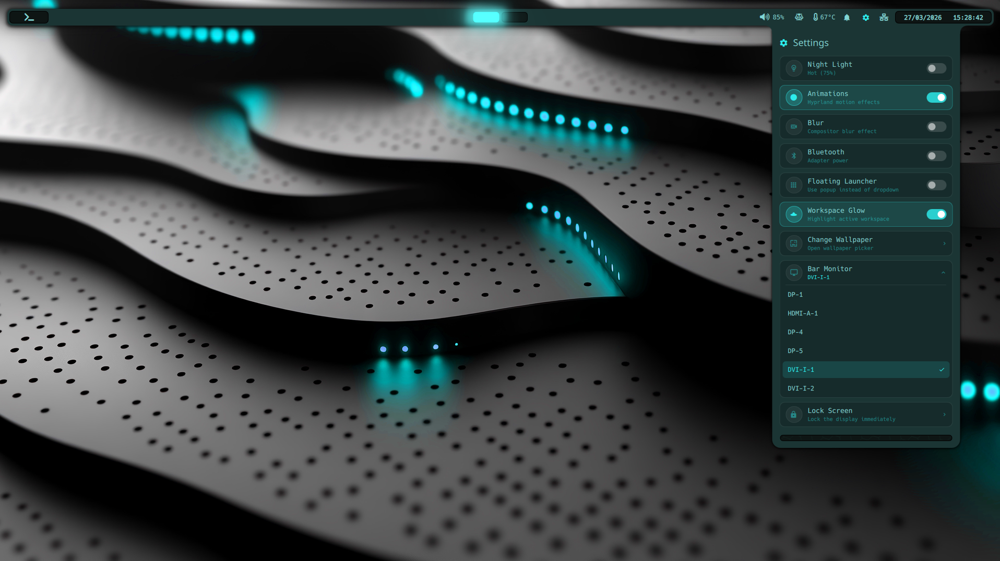

# Quickshell Configuration



Custom Quickshell desktop UI for Hyprland, focused on a fast top bar, keyboard-first dropdowns, and modular QML components.

Last Updated: June 1, 2026

## What Changed Recently

- Removed network status flash effects in `modules/network/CommStatusButton.qml` and `modules/network/SecureCommStatusButton.qml` while keeping bar fill animations.
- Aligned network status row text/graph vertically and resized mini graphs in `modules/network/CommStatusButton.qml` and `modules/network/SecureCommStatusButton.qml` to match `systemGraphs` bar size (75x12).
- Replaced status words in `modules/network/CommStatusButton.qml` and `modules/network/SecureCommStatusButton.qml` with SystemGraphs-style mini bar indicators.
- Added connected status animation for `modules/network/CommStatusButton.qml` and `modules/network/SecureCommStatusButton.qml`: flashes white 3 times, then fades to the source color.
- Added disconnected status animation for `modules/network/CommStatusButton.qml` and `modules/network/SecureCommStatusButton.qml`: flashes red 3 times, then fades to the primary color.
- Adjusted `modules/network/SecureCommStatusButton.qml` so the ESTABLISHED/DISCONNECTED status text is rendered 1px lower for visual alignment.
- Adjusted `modules/network/CommStatusButton.qml` so the ACTIVE/DISCONNECTED status text is rendered 1px lower for visual alignment.
- Aligned `modules/network/SecureCommStatusButton.qml` VPN detection with dashboard network tab logic by checking active WireGuard connections from `nmcli`.
- Fixed false-positive VPN detection in `modules/network/SecureCommStatusButton.qml` by removing process-name checks and requiring actual connected status.
- Updated `modules/network/SecureCommStatusButton.qml` to check Surfshark active/disconnected status every second.
- Added and integrated system graphs in the left bar section (`CPU`, `RAM`, `Volume`, `Temp`) via `modules/systemGraphs/SystemGraphsPanel.qml`.
- Updated the top bar composition in `shell.qml`:
  - `SystemGraphsPanel` is now active.
  - `VolumeButton` is no longer placed in the bar.
  - Lockscreen remains available via shortcut/process launch; the bar lock button is not currently shown.
- Active panel set in `shell.qml` now focuses on: calendar, VLAN, power profile, power, bluetooth, wallpaper, settings, app launcher, tray menu, notifications, and dashboard.
- Project docs cleaned to remove stale claims about currently active standalone weather/volume/right-panel/chat modules.
- File structure updated to match the current repository state.

## Overview

The shell is split into three areas:

- Left: app launcher button + system graphs panel
- Center: workspace panel + glow overlay
- Right: system updates, bluetooth, power profile, notifications, settings, VLAN, tray, clock/calendar, power

Core behavior is coordinated in `shell.qml` through:

- `switchPanel(openFn)`: closes open panels before opening another
- `closeAllDropdowns()`: one-shot close for all coordinated panels
- `assignedScreen` resolution based on `Config.barMonitor` with fallback handling

## Module Status

### Active In `shell.qml`

- `appLauncher`
- `bluetooth`
- `calendar`
- `clock`
- `dashboard`
- `lockscreen` (process/shortcut-driven)
- `network` (VLAN components in bar; network UI inside dashboard)
- `notifications`
- `power`
- `settings`
- `systemGraphs`
- `systemTray`
- `systemUpdates`
- `wallpaper`
- `workspaces`

### Present But Not Imported In `shell.qml`

- `chat`
- `rightPanelSlider`
- `volume`
- `weather`

### Present But Not Fully Integrated

- `pomodoro` (no module export file)
- `vpn` (standalone files present; VPN flow is handled in dashboard network tab)

## File Structure

```text
quickshell/
|- shell.qml
|- README.md
|- qmldir
|- Colors.qml
|- Config.qml
|- NumbersToText.qml
|- cava.conf
|- .gitignore
|
|- assets/
|  |- colorize-map.sh
|  |- map_colorized_latest.png
|  |- map_colorized_latest_dark.png
|  |- map_default.png
|  |- .map_last_color
|  |- nedry.mp3
|  |- screenshot2.png
|  \- vids/
|     \- 2026-03-31 18-01-15.mp4
|
|- base/
|  |- DropdownBase.qml
|  |- DropdownTopFlare.qml
|  |- HexSweepPanel.qml
|  |- MatrixRain.qml
|  |- OverlayPanel.qml
|  |- SelectableCard.qml
|  \- SettingsToggleRow.qml
|
|- hyprland/
|  |- blue-light-filter-25.glsl
|  |- blue-light-filter-50.glsl
|  |- blue-light-filter-75.glsl
|  |- blue-light-filter-100.glsl
|  \- shaders.lua
|
|- state/
|  |- Audio.qml
|  |- BluetoothState.qml
|  |- VolumeState.qml
|  |- WeatherState.qml
|  |- WeatherStateOpenWeather.qml
|  \- qmldir
|
\- modules/
   |- appLauncher/
   |  |- AppLauncher.qml
   |  |- AppLaunchDropdown.qml
   |  \- AppLauncherButton.qml
   |
   |- bluetooth/
   |  |- BluetoothButton.qml
   |  \- BluetoothDropdown.qml
   |
   |- calendar/
   |  \- CalendarPanel.qml
   |
   |- chat/
   |  |- ChatShortcut.qml
   |  \- qmldir
   |
   |- clock/
   |  \- ClockPanel.qml
   |
   |- dashboard/
   |  |- DashboardButton.qml
   |  |- DashboardDropdown.qml
   |  \- speedtest_cache.json
   |
   |- lockscreen/
   |  |- LockscreenButton.qml
   |  |- LockscreenContext.qml
   |  |- LockscreenService.qml
   |  |- LockscreenSurface.qml
   |  |- qmldir
   |  \- pam/
   |     \- password.conf
   |
   |- network/
   |  |- NetworkAdminDropdown.qml
   |  |- NetworkButton.qml
   |  |- NetworkDropdown.qml
   |  |- VlanButton.qml
   |  |- VlanDropdown.qml
   |  \- qmldir
   |
   |- notifications/
   |  |- NotifButton.qml
   |  |- NotifCard.qml
   |  |- NotifDropdown.qml
   |  |- NotifPopups.qml
   |  |- NotifService.qml
   |  \- qmldir
   |
   |- pomodoro/
   |  |- PomodoroButton.qml
   |  \- PomodoroDropdown.qml
   |
   |- power/
   |  |- BatteryButton.qml
   |  |- BatteryDropdown.qml
   |  |- PowerButton.qml
   |  |- PowerDropdown.qml
   |  |- PowerProfileButton.qml
   |  |- PowerProfileDropdown.qml
   |  |- TemperatureButton.qml
   |  |- TemperatureDropdown.qml
   |  |- logout.sh
   |  |- reboot.sh
   |  \- shutdown.sh
   |
   |- rightPanelSlider/
   |  |- RightPanelButton.qml
   |  |- RightPanelSlider.qml
   |  \- qmldir
   |
   |- settings/
   |  |- SettingsButton.qml
   |  |- SettingsDropdown.qml
   |  |- settings.json
   |  |- settings.local.example.json
   |  \- settings.local.json
   |
   |- systemGraphs/
   |  |- SystemGraphsPanel.qml
   |  \- qmldir
   |
   |- systemTray/
   |  |- SystemTrayPanel.qml
   |  \- TrayMenu.qml
   |
   |- systemUpdates/
   |  \- SystemUpdatesButton.qml
   |
   |- volume/
   |  |- VolumeButton.qml
   |  \- VolumeDropdown.qml
   |
   |- vpn/
   |  |- VPNDropdown.qml
   |  \- VPNModule.qml
   |
   |- wallpaper/
   |  |- WallpaperButton.qml
   |  \- WallpaperDropdown.qml
   |
   |- weather/
   |  |- WeatherButton.qml
   |  |- WeatherDropdown.qml
   |  \- qmldir
   |
   \- workspaces/
      |- WorkspaceGlowOverlay.qml
      \- WorkspacesPanel.qml
```

## Active Shortcuts

Defined as global shortcuts in `shell.qml`:

- `closeAllDropdowns`
- `toggleWallpaperDropdown`
- `toggleAppLauncher`
- `lockScreen`
- `triggerSystemUpdate`
- `toggleSettingsDropdown`
- `toggleNotifDropdown`
- `toggleDashboardDropdown`

## Notes On Configuration

- Runtime settings are persisted through `Config.qml` + `modules/settings/settings.json`.
- Local-only secrets/config should remain in `modules/settings/settings.local.json`.
- Weather/OpenWeather state exists in `state/`, while standalone weather UI module is currently not imported.
- Volume state exists and is still consumed by `systemGraphs`, even though standalone volume UI is not currently placed in the bar.

## Dependencies

Core runtime and integrations used in this setup:

- `quickshell`
- `qt6-base`, `qt6-declarative`
- `hyprland`
- `pipewire`, `wireplumber`
- `networkmanager`
- `bluez`, `bluez-utils`
- `power-profiles-daemon`
- `cava`
- `playerctl`
- `kitty`
- `awww`
- `matugen`
- `upower` (battery details)
- `lm_sensors` (temperature)
- `speedtest-cli` (dashboard speed test)
- `python3`

## Disclaimer

This is a personal learning project and evolving daily-use config. Some modules are intentionally kept in-repo but disabled in `shell.qml` so they can be re-enabled quickly.